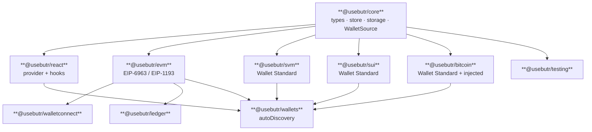

<div align="center">
  <picture>
    <source media="(prefers-color-scheme: dark)" srcset="./assets/butr-logo-dark.svg">
    
  </picture>
  <br />
  <br />
</div>

butr is a multi-chain wallet management library for React. It discovers EVM, Solana, Sui, and Bitcoin wallets in the browser, manages their connections across the lifetime of an app, and exposes them through composable hooks — so a single component can talk to a MetaMask account, a Phantom Solana account, a Sui Wallet account, and an Xverse Bitcoin account in the same render pass.

The library is split across small focused packages so consumers bundle only what they need. The monorepo also ships eleven demo apps that exercise butr across the major React frameworks and integration patterns.

**At a glance**

- **What it is.** A discovery + connection-state layer for browser wallets across EVM, SVM, Sui, and Bitcoin.
- **What it gives you.** A typed React store + hooks; one provider; persisted connections; multi-wallet, multi-chain in a single render pass.
- **Who it's for.** Apps that need more than one chain side by side (EVM + Solana + Sui + Bitcoin) and any app that wants standards-first discovery (EIP-6963 + Wallet Standard) without coupling to a chain library or connect-modal UI.
- **Docs.** Full reference and guides at [`docs.usebutr.com`](https://docs.usebutr.com).

## Quickstart

```bash
pnpm add @usebutr/react @usebutr/wallets
```

Mount the provider once. `autoDiscovery()` returns a discovery source that finds every EIP-6963 EVM wallet, every Wallet Standard SVM / Sui / Bitcoin wallet, plus injected legacy fallbacks for EVM (`window.ethereum`) and Bitcoin (`window.unisat`, `window.XverseProviders`, `window.btc`).

```tsx
// src/wallet-provider.tsx
import { WalletManagerProvider } from "@usebutr/react";
import { autoDiscovery } from "@usebutr/wallets";

const discovery = autoDiscovery();

export const WalletProvider = ({ children }: { children: React.ReactNode }) => (
  <WalletManagerProvider discovery={discovery} storageKeyPrefix="my-app">
    {children}
  </WalletManagerProvider>
);
```

Then read from hooks anywhere below the provider:

```tsx
// src/connect-button.tsx
import {
  useConnectWallet,
  useConnectedWallets,
  useDisconnectWallet,
  useDiscoveredWallets,
  useIsHydrated,
} from "@usebutr/react";

export const ConnectButton = () => {
  const isHydrated = useIsHydrated();
  const discovered = useDiscoveredWallets();
  const connected = useConnectedWallets();
  const connect = useConnectWallet();
  const disconnect = useDisconnectWallet();

  if (!isHydrated) return null;

  return (
    <div>
      {discovered.map((w) => (
        <button key={w.id} onClick={() => connect(w.id)}>
          Connect {w.name} ({w.chainPlatform})
        </button>
      ))}
      {connected.map((w) => (
        <button key={w.connector.id} onClick={() => disconnect(w.connector.id)}>
          Disconnect {w.connector.name}
        </button>
      ))}
    </div>
  );
};
```

That's the entire surface area for a basic dapp: a provider and a few hooks. Signing, balances, chain switching, and per-platform composition all build on the same shape.

## Highlights

- **Multi-chain by default.** EVM (EIP-1193 / EIP-6963), Solana (Wallet Standard), Sui (Wallet Standard), and Bitcoin (Wallet Standard + injected fallback for sats-connect / Unisat / OKX) on equal footing. No "one chain at a time" mode.
- **Framework-agnostic core.** `@usebutr/core` is React-free. `@usebutr/react` is the binding, not the foundation. Use the core directly from any TS runtime.
- **Modular packages.** Install only the protocol adapters you ship. EVM-only dapp? Skip `@usebutr/svm` entirely.
- **No middleware lock-in.** Every adapter is just a `WalletAdapter`. Bring WalletConnect, Ledger, or your own.
- **Composes with the ecosystem.** Sits beside viem, wagmi, `gill`, framework-kit (`@solana/client` + `@solana/react-hooks`), `@solana/kit`, `@solana/wallet-adapter-react` (and legacy `@solana/web3.js`). butr owns discovery and connection state; your existing library owns RPC and signing.

## When to use butr

| Reach for butr when…                                                                | Reach for something else when…                                                  |
| ----------------------------------------------------------------------------------- | ------------------------------------------------------------------------------- |
| You need EVM **and** Solana side by side in the same app.                           | You're single-chain EVM and already happy with wagmi + RainbowKit.              |
| You want raw signers + your own UI, not a prefab connect modal.                     | You want a turnkey modal and don't mind the chain-library coupling that brings. |
| You care about standards (EIP-6963 + Wallet Standard) over per-wallet branch lists. | You need account abstraction, in-app wallets, or social login as the product.   |

butr deliberately does **not** ship an RPC client, a connect-modal UI, key custody, balance reads, or a transaction builder. It hands off cleanly to viem, wagmi, `@solana/kit`, `gill`, etc.

## Packages

Ten published packages, each with a single responsibility.

| Package                  | Purpose                                                                                               | Install                           |
| ------------------------ | ----------------------------------------------------------------------------------------------------- | --------------------------------- |
| `@usebutr/core`          | Types, store, storage, and the `WalletSource` discovery seam. No React, no protocols.                 | `pnpm add @usebutr/core`          |
| `@usebutr/react`         | React provider and hooks on top of `@usebutr/core`.                                                   | `pnpm add @usebutr/react`         |
| `@usebutr/evm`           | EIP-1193 / EIP-6963 / injected wallet discovery and adapters.                                         | `pnpm add @usebutr/evm`           |
| `@usebutr/svm`           | Wallet Standard adapter for Solana / SVM.                                                             | `pnpm add @usebutr/svm`           |
| `@usebutr/sui`           | Wallet Standard adapter for Sui.                                                                      | `pnpm add @usebutr/sui`           |
| `@usebutr/bitcoin`       | Wallet Standard adapter for Bitcoin + injected fallback (sats-connect / Unisat / OKX / `window.btc`). | `pnpm add @usebutr/bitcoin`       |
| `@usebutr/wallets`       | Batteries-included composition: EVM + SVM + Sui + Bitcoin discovery + `autoDiscovery()`.              | `pnpm add @usebutr/wallets`       |
| `@usebutr/walletconnect` | WalletConnect v2 adapter — EVM, SVM, Sui, Bitcoin namespaces, single or multi-namespace.              | `pnpm add @usebutr/walletconnect` |
| `@usebutr/ledger`        | Ledger hardware-wallet adapter — EVM, SVM, Sui, Bitcoin over WebUSB.                                  | `pnpm add @usebutr/ledger`        |
| `@usebutr/testing`       | Fake adapters, fake persistence, mock storage for tests.                                              | `pnpm add -D @usebutr/testing`    |

> Workspace-internal packages — `@repo/typescript-config`, `@repo/config-vitest`, `@repo/wallet-extensions` — back the monorepo's tooling and tests and are not published.

## Architecture



`@usebutr/core` owns the types and the store. Every adapter implements the same `WalletAdapter` shape. `@usebutr/wallets` is a convenience layer that composes EVM + SVM + Sui + Bitcoin discovery; pick the lower-level packages directly if you want to ship only one platform.

## Recipes

<details>
<summary><b>Multi-chain (batteries-included)</b> — one provider, EVM + SVM + Sui + Bitcoin discovered together</summary>

```tsx
// apps/demo-vite/src/wallet-provider.tsx
import { WalletManagerProvider } from "@usebutr/react";
import { autoDiscovery } from "@usebutr/wallets";

const discovery = autoDiscovery();

export const WalletProvider = ({ children }: { children: React.ReactNode }) => (
  <WalletManagerProvider discovery={discovery} storageKeyPrefix="butr-demo">
    {children}
  </WalletManagerProvider>
);
```

`useConnectedWallets()` returns every active wallet across all four platforms. Render them side by side.

</details>

<details>
<summary><b>EVM-only</b> — skip <code>@usebutr/wallets</code>, skip the SVM bundle</summary>

```tsx
// apps/demo-next/src/wallet-provider.tsx
"use client";

import { createWalletSource } from "@usebutr/core";
import { discoverEvmAdapters } from "@usebutr/evm";
import { WalletManagerProvider } from "@usebutr/react";

const evmDiscovery = createWalletSource(discoverEvmAdapters);

export const WalletProvider = ({ children }: { children: React.ReactNode }) => (
  <WalletManagerProvider discovery={evmDiscovery} storageKeyPrefix="my-app">
    {children}
  </WalletManagerProvider>
);
```

Drops `@usebutr/svm` and `@usebutr/wallets` from your bundle entirely.

</details>

<details>
<summary><b>SVM-only</b> — Wallet Standard, no EVM code shipped</summary>

```tsx
// apps/demo-with-solana-kit/src/wallet-provider.tsx
import { createWalletSource } from "@usebutr/core";
import { WalletManagerProvider } from "@usebutr/react";
import { discoverSvmAdapters } from "@usebutr/svm";

const svmDiscovery = createWalletSource(discoverSvmAdapters);

export const WalletProvider = ({ children }: { children: React.ReactNode }) => (
  <WalletManagerProvider discovery={svmDiscovery} storageKeyPrefix="my-svm-app">
    {children}
  </WalletManagerProvider>
);
```

</details>

<details>
<summary><b>Sui-only</b> — Wallet Standard, no EVM/SVM/Bitcoin code shipped</summary>

```tsx
// apps/demo-with-sui/src/wallet-provider.tsx
import { createWalletSource } from "@usebutr/core";
import { WalletManagerProvider } from "@usebutr/react";
import { discoverSuiAdapters } from "@usebutr/sui";

const suiDiscovery = createWalletSource(discoverSuiAdapters);

export const WalletProvider = ({ children }: { children: React.ReactNode }) => (
  <WalletManagerProvider discovery={suiDiscovery} storageKeyPrefix="my-sui-app">
    {children}
  </WalletManagerProvider>
);
```

</details>

<details>
<summary><b>Bitcoin-only</b> — Wallet Standard + injected fallback for legacy Bitcoin wallets</summary>

```tsx
// apps/demo-with-bitcoin/src/wallet-provider.tsx
import { discoverBitcoinAdapters, discoverInjectedBitcoinAdapter } from "@usebutr/bitcoin";
import type { WalletSource } from "@usebutr/core";
import { WalletManagerProvider } from "@usebutr/react";

const bitcoinDiscovery: WalletSource = {
  subscribe: (onAdapter) => {
    const seen = new Set<string>();
    const emit = (a) => {
      if (seen.has(a.id)) return;
      seen.add(a.id);
      onAdapter(a);
    };
    const offStandard = discoverBitcoinAdapters(emit);
    const offInjected = discoverInjectedBitcoinAdapter(emit, {
      hasAnyWalletStandardAdapter: () => seen.size > 0,
    });
    return () => {
      offStandard();
      offInjected();
    };
  },
};

export const WalletProvider = ({ children }: { children: React.ReactNode }) => (
  <WalletManagerProvider discovery={bitcoinDiscovery} storageKeyPrefix="my-btc-app">
    {children}
  </WalletManagerProvider>
);
```

Covers Phantom (Bitcoin), Magic Eden, Leather, modern OKX (Wallet Standard) plus Xverse (sats-connect), Unisat, OKX legacy, and `window.btc` (injected fallback).

</details>

<details>
<summary><b>WalletConnect (multi-platform)</b> — one QR scan, adapters for EVM + SVM + Sui + Bitcoin</summary>

```tsx
import { WalletManagerProvider } from "@usebutr/react";
import { autoDiscovery } from "@usebutr/wallets";
import { createWalletConnectAdapters } from "@usebutr/walletconnect";

const discovery = autoDiscovery();
const wcs = await createWalletConnectAdapters({
  projectId: process.env.NEXT_PUBLIC_WC_PROJECT_ID!,
  metadata: { name: "My dapp", url: "https://my-dapp.example" },
  namespaces: {
    evm: ["eip155:1"],
    svm: ["solana:mainnet"],
    sui: ["sui:mainnet"],
    bitcoin: ["bip122:000000000019d6689c085ae165831e93"],
  },
  onPairingUri: (uri) => setQrUri(uri),
});
const extra = new Map(wcs.map((a) => [a.id, a] as const));

<WalletManagerProvider
  discovery={discovery}
  connectors={wcs.map((a) => ({ id: a.id, name: a.name, chainPlatform: a.chainPlatform }))}
  createConnector={(id) => extra.get(id) ?? null}
>
  {children}
</WalletManagerProvider>;
```

One paired session, one adapter per namespace — each suffixed (`walletconnect-evm`, `walletconnect-svm`, …) so they coexist in the pool. Omit a key to skip a platform.

</details>

<details>
<summary><b>Ledger (multi-platform)</b> — hardware-wallet adapters for EVM / SVM / Sui / Bitcoin</summary>

```tsx
import { createLedgerAdapter } from "@usebutr/ledger";
import { WalletManagerProvider } from "@usebutr/react";
import { autoDiscovery } from "@usebutr/wallets";

const [evm, svm, sui, btc] = await Promise.all([
  createLedgerAdapter({ platform: "evm", chainId: 1, accountCount: 3 }),
  createLedgerAdapter({ platform: "svm", cluster: "mainnet", accountCount: 3 }),
  createLedgerAdapter({ platform: "sui", cluster: "mainnet", accountCount: 3 }),
  createLedgerAdapter({ platform: "bitcoin", addressFormat: "bech32", accountCount: 3 }),
]);
const all = [evm, svm, sui, btc];
const extra = new Map(all.map((a) => [a.id, a] as const));

<WalletManagerProvider
  discovery={autoDiscovery()}
  connectors={all.map((a) => ({ id: a.id, name: a.name, chainPlatform: a.chainPlatform }))}
  createConnector={(id) => extra.get(id) ?? null}
>
  {children}
</WalletManagerProvider>;
```

Each per-platform factory is also exported directly (`createEvmLedgerAdapter`, `createSvmLedgerAdapter`, `createSuiLedgerAdapter`, `createBitcoinLedgerAdapter`). Ledger signs but doesn't broadcast — wrap `getSigner()` with viem / `@solana/kit` / `@mysten/sui` / `bitcoinjs-lib` and your own RPC for submission.

</details>

<details>
<summary><b>Bridge to viem</b> — <code>getSigner()</code> returns a raw EIP-1193 provider</summary>

```tsx
// apps/demo-with-viem/src/app.tsx
import { useActiveWallet } from "@usebutr/react";
import { createWalletClient, custom, type EIP1193Provider } from "viem";
import { sepolia } from "viem/chains";

const wallet = useActiveWallet();
const provider = (await wallet.connector.getSigner()) as EIP1193Provider;

const walletClient = createWalletClient({
  account: wallet.account.walletAddress as `0x${string}`,
  chain: sepolia,
  transport: custom(provider),
});

await walletClient.signMessage({
  account: wallet.account.walletAddress as `0x${string}`,
  message: "Hello from butr + viem",
});
```

butr exposes the raw EIP-1193 provider; viem's `custom()` transport wraps it. Use a separate `createPublicClient` with `http()` for chain reads so you don't bounce balance calls through the wallet.

</details>

<details>
<summary><b>Bridge to wagmi</b> — inject butr's provider into wagmi's <code>injected</code> connector</summary>

```tsx
// apps/demo-with-wagmi/src/app.tsx
import { injected } from "@wagmi/connectors";
import { connect, createConfig, http, type Config } from "@wagmi/core";
import { type EIP1193Provider } from "viem";
import { sepolia } from "viem/chains";

const provider = (await wallet.connector.getSigner()) as EIP1193Provider;

const wagmiConfig: Config = createConfig({
  chains: [sepolia],
  connectors: [
    injected({
      target: {
        id: wallet.connector.id,
        name: wallet.connector.name,
        provider: () => provider,
      },
    }),
  ],
  transports: { [sepolia.id]: http() },
});

await connect(wagmiConfig, { connector: wagmiConfig.connectors[0] });
// then use signMessage(wagmiConfig, …), sendTransaction(wagmiConfig, …), etc.
```

The wallet has already authorised the dapp via butr, so wagmi's `connect()` lifecycle resolves silently — no second popup.

</details>

<details>
<summary><b>React Native / Expo</b> — swap localStorage for AsyncStorage</summary>

```tsx
// apps/demo-expo-web/src/async-storage-driver.ts
import AsyncStorage from "@react-native-async-storage/async-storage";
import type { StorageDriver } from "@usebutr/core";

export const asyncStorageDriver: StorageDriver = {
  getItem: (key) => AsyncStorage.getItem(key),
  removeItem: (key) => AsyncStorage.removeItem(key),
  setItem: (key, value) => AsyncStorage.setItem(key, value),
};
```

```tsx
// apps/demo-expo-web/src/wallet-provider.tsx
import { WalletStorage } from "@usebutr/core";
import { WalletManagerProvider } from "@usebutr/react";
import { autoDiscovery } from "@usebutr/wallets";
import { asyncStorageDriver } from "./async-storage-driver";

const storage = new WalletStorage({
  keyPrefix: "butr-demo",
  persistent: asyncStorageDriver,
  session: asyncStorageDriver,
});

export const WalletProvider = ({ children }: { children: React.ReactNode }) => (
  <WalletManagerProvider discovery={autoDiscovery()} storage={storage} storageKeyPrefix="butr-demo">
    {children}
  </WalletManagerProvider>
);
```

`StorageDriver` is the seam: bring any get/set/remove implementation.

</details>

## Core hooks

The most-used hooks from `@usebutr/react`. Full list and reference at [`docs.usebutr.com`](https://docs.usebutr.com).

| Hook                      | Returns                                                                                  |
| ------------------------- | ---------------------------------------------------------------------------------------- |
| `useIsHydrated()`         | `boolean` — `true` once persisted connections have been rehydrated.                      |
| `useDiscoveredWallets()`  | `WalletAdapter[]` — every wallet the active sources have surfaced.                       |
| `useConnectWallet()`      | `(adapterId) => Promise<void>` — start a connection flow.                                |
| `useDisconnectWallet()`   | `(connectorId) => void` — drop a single connection.                                      |
| `useActiveWallet()`       | The currently active `ConnectedWallet`, or `null`.                                       |
| `useConnectedWallets()`   | All active `ConnectedWallet`s across platforms.                                          |
| `useSelectedWallet()`     | The wallet selected for the active platform (EVM / SVM / Sui / Bitcoin).                 |
| `usePool()`               | The raw connection pool — useful when you need to iterate per-platform.                  |
| `useAccounts()`           | Accounts on the active connector.                                                        |
| `useBalance(connectorId)` | Async-state balance (`{ status, data, error }`) for one connector.                       |
| `useSigner()`             | Async-state signer (EIP-1193 provider for EVM, Wallet Standard for SVM / Sui / Bitcoin). |
| `useRequestAccounts()`    | `(connectorId) => Promise<…>` — prompt for additional accounts.                          |
| `useSetActiveConnector()` | `(connectorId) => void` — promote a connection to active.                                |

## Demos

Two flavors of demo ship in this repo.

### Framework demos — kitchen-sink references

Each one exercises every public hook in `@usebutr/react` against discovered wallets. Use them as the canonical example for the framework you're targeting.

| App                   | Framework                       | Dev URL                 |
| --------------------- | ------------------------------- | ----------------------- |
| `demo-vite`           | Vite 7 + React 19 (SPA)         | `http://localhost:5173` |
| `demo-next`           | Next.js 16 (App Router)         | `http://localhost:3000` |
| `demo-tanstack-start` | TanStack Start (Vite SSR)       | `http://localhost:3001` |
| `demo-expo-web`       | Expo (React Native, web target) | `http://localhost:8081` |

### Integration demos — butr + existing web3 libraries

Each integration demo shows butr composing with a library you may already be using. butr handles wallet discovery and connection state; the integration library handles chain reads, signing, and submission. Every demo covers the same four scenarios: **connect → read balance → sign message → send transaction.**

| App                               | Library                               | Network      | Dev URL                 |
| --------------------------------- | ------------------------------------- | ------------ | ----------------------- |
| `demo-with-viem`                  | viem                                  | EVM, Sepolia | `http://localhost:5175` |
| `demo-with-wagmi`                 | wagmi + `@wagmi/core`                 | EVM, Sepolia | `http://localhost:5176` |
| `demo-with-solana-framework-kit`  | framework-kit (`@solana/react-hooks`) | SVM, Devnet  | `http://localhost:5181` |
| `demo-with-gill`                  | `gill`                                | SVM, Devnet  | `http://localhost:5180` |
| `demo-with-solana-kit`            | `@solana/kit`                         | SVM, Devnet  | `http://localhost:5179` |
| `demo-with-solana-wallet-adapter` | `@solana/wallet-adapter-react`        | SVM, Devnet  | `http://localhost:5178` |
| `demo-with-solana-web3js`         | `@solana/web3.js` (legacy v1)         | SVM, Devnet  | `http://localhost:5177` |

All web demos bind distinct ports so they can run concurrently.

## Stack

- **Library:** `@usebutr/*` workspace packages (React 19, zustand).
- **Build:** Turborepo + pnpm workspaces; tsdown for package builds (tree-shaking, minification, source maps, watch mode).
- **Linting / formatting:** oxlint + oxfmt.
- **Testing:** Vitest for unit tests.

## Setup

### Prerequisites

- **Node.js 24** (`nvm install 24 && nvm use 24`)
- **pnpm 10** (`npm install -g pnpm@10`)

### 1. Install dependencies

```bash
pnpm install
```

### 2. Run a demo

```bash
pnpm dev --filter=demo-vite
# or any of:
#   demo-next, demo-tanstack-start, demo-expo-web,
#   demo-with-viem, demo-with-wagmi,
#   demo-with-solana-framework-kit, demo-with-gill, demo-with-solana-kit,
#   demo-with-solana-wallet-adapter, demo-with-solana-web3js
```

Open the URL from the table above. Distinct ports let every demo run side by side.

## Scripts

| Command             | Description                                |
| ------------------- | ------------------------------------------ |
| `pnpm dev`          | Start every app in development mode.       |
| `pnpm build`        | Build every package and app.               |
| `pnpm test`         | Run unit tests across the monorepo.        |
| `pnpm lint`         | Run oxlint.                                |
| `pnpm format`       | Format with oxfmt.                         |
| `pnpm format:check` | Check formatting without writing.          |
| `pnpm typecheck`    | Run TypeScript checks across the monorepo. |
| `pnpm clean`        | Clean all build artifacts.                 |
| `pnpm fallow:dead`  | Find unused exports.                       |

## Contributing & docs

Docs live in [`apps/docs`](./apps/docs) and are published at [`docs.usebutr.com`](https://docs.usebutr.com). Releases go out via Changesets — run `pnpm changeset` alongside any package change and follow the prompts.
