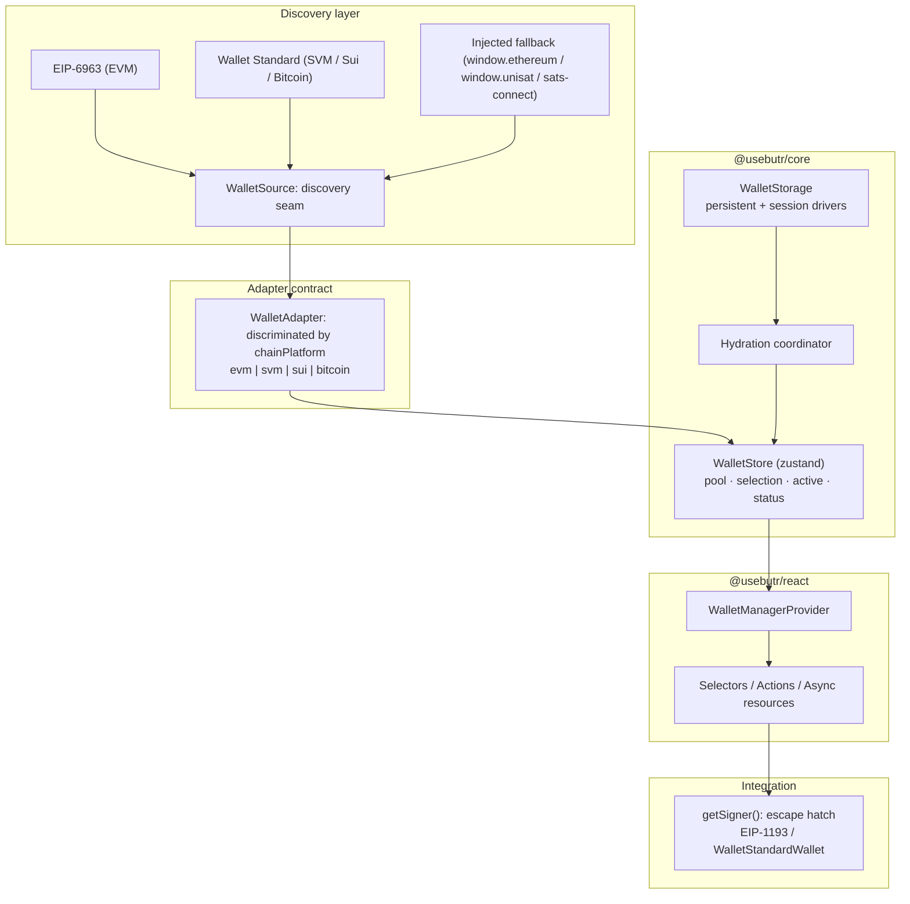

butr is six layers stacked on a single core type. This page walks the runtime
top to bottom, naming the seams between each layer so you know where to swap
behavior in and out.

## The picture in one diagram



## Layer 1: Discovery

Browser wallets announce themselves through one of two standards:

- **EIP-6963** for EVM: wallets dispatch a custom event on `window`.
- **Wallet Standard** for SVM, Sui, Bitcoin, and Polkadot: wallets register
  through the global `@wallet-standard/app` registry.

Each `@usebutr/<platform>` package exposes one or two discoverers:

- `discoverEvmAdapters` + `discoverInjectedAdapter` (`@usebutr/evm`)
- `discoverSvmAdapters` (`@usebutr/svm`)
- `discoverSuiAdapters` (`@usebutr/sui`)
- `discoverBitcoinAdapters` + `discoverInjectedBitcoinAdapter` (`@usebutr/bitcoin`)

A discoverer takes a callback and returns an unsubscribe function. It's a pull
model: discovery only happens when a `WalletSource` subscribes.

### The `WalletSource` seam

```ts
type WalletSource = {
  subscribe(onAdapter: (adapter: WalletAdapter) => void): () => void;
};
```

`@usebutr/wallets` ships `autoDiscovery()` which composes all five platforms.
For single-platform or custom setups, `createWalletSource(discoverEvmAdapters)`
wraps a bare discoverer into a `WalletSource`; that's the only contract the
provider cares about.

The seam is what makes butr framework-agnostic. Your test suite can pass a
synthetic `WalletSource` that emits fake adapters; React Native binds to the
same shape.

## Layer 2: The `WalletAdapter` contract

Every wallet in butr (discovered, registered, hardware, mobile, faked for a
test) implements the same `WalletAdapter` type. It's a **discriminated union
on `chainPlatform`**:

```ts
type WalletAdapter =
  | EvmAdapter // chainPlatform: "evm"
  | SvmAdapter // chainPlatform: "svm"
  | SuiAdapter // chainPlatform: "sui"
  | BitcoinAdapter; // chainPlatform: "bitcoin"
```

The discriminant lets TypeScript narrow correctly: after
`if (adapter.chainPlatform === "sui") { ... }`, `adapter.signTransaction`
has Sui-specific types: no `unknown`, no `as any`.

Each adapter has two halves:

- **Connector half** (called by butr's runtime): `connect`, `disconnect`,
  `getAccounts`, `subscribe`, `getSigner`. Lifecycle methods butr drives.
- **Wallet half** (called by your app): `signMessage`, `signTransaction`,
  `sendTransaction`, `getBalance`, `switchChain`. Per-platform features.

A `WalletCapabilities` object on each adapter declares which wallet-half
methods are wired. Gate UI on capabilities, not on method presence; see
[capabilities](/concepts/capabilities).

## Layer 3: The store (`@usebutr/core`)

The store is a zustand store wrapped in `createWalletStore()`. It tracks four
slices of state:

| Slice          | Shape                                        | Set by                                   |
| -------------- | -------------------------------------------- | ---------------------------------------- |
| **Discovered** | `Map<id, WalletAdapter>`                     | Discovery layer (Layer 1)                |
| **Pool**       | `Map<connectorId, ConnectedWallet>`          | `connect` / `disconnect` actions         |
| **Selection**  | `Record<ChainPlatform, connectorId \| null>` | `setSelectedWallet` action               |
| **Status**     | `Record<connectorId, ConnectionStatus>`      | Lifecycle (`connecting`, `connected`, …) |

`ConnectedWallet` = `{ connector: WalletAdapter; account: Account }`. The
pool holds every connection across all five platforms simultaneously. The
**active wallet** is derived: `selection[activePlatform] → pool[id]`.

See [pool, selection, active](/concepts/pool-selection-active) for the
mental model behind these three layers.

The store is React-free. Anything that consumes wallet state (a Web
Worker, a Node script, a non-React renderer) can `subscribe` to it
directly.

## Layer 4: Storage and hydration

Two drivers, two scopes:

```ts
class WalletStorage {
  persistent: StorageDriver; // localStorage by default
  session: StorageDriver; // sessionStorage by default
}
```

`StorageDriver` is the seam:

```ts
type StorageDriver = {
  getItem(key: string): MaybePromise<string | null>;
  setItem(key: string, value: string): MaybePromise<void>;
  removeItem(key: string): MaybePromise<void>;
};
```

`createBrowserStorageDriver`, `createCookieStorageDriver`, and
`createMemoryStorageDriver` ship by default. Bring AsyncStorage, IndexedDB,
or anything else by implementing the three methods.

### Hydration

On mount, the provider replays the last persisted pool into the store. But
adapters announce **asynchronously**: a wallet that was connected last
session may not have registered with Wallet Standard yet at first render.
The store tracks each pending connector in `pendingIds`. When a discovered
adapter matches, hydration completes for that id.

`useIsHydrated()` returns `true` once the first hydration pass settles. UI
that depends on connection state should gate on this; see
[hydration](/concepts/hydration).

## Layer 5: React bindings (`@usebutr/react`)

`WalletManagerProvider` wires the store into React context. Below it, hooks
split by return shape:

- **Selectors** (`useActiveWallet`, `useConnectedWallets`,
  `useDiscoveredWallets`, `useSelectedWallet`, `usePool`, `useAccounts`,
  `useIsHydrated`): synchronous reads with shallow-equality memoisation.
- **Actions** (`useConnectWallet`, `useDisconnectWallet`,
  `useSetActiveConnector`, `useRequestAccounts`): stable callbacks.
- **Async resources** (`useBalance`, `useSigner`, `useTransactionReceipt`):
  `{ status, data, error }` shape, cached per connector, invalidated on
  account/chain change.

Each hook is one file, one responsibility. No barrel re-exports that fan
out unrelated subscriptions.

## Layer 6: Integration escape hatch

`getSigner()` is the seam to chain libraries. butr does **not** ship an RPC
client, a transaction builder, or a connect modal; instead, every adapter
exposes the raw, platform-native signer:

| Platform | `getSigner()` returns                                    |
| -------- | -------------------------------------------------------- |
| EVM      | `Eip1193Provider`: pass to viem/ethers/wagmi.            |
| SVM      | `WalletStandardWallet`: pass to `@solana/kit` / web3.js. |
| Sui      | `WalletStandardWallet`: pass to `@mysten/sui`.           |
| Bitcoin  | `WalletStandardWallet`: pass to `bitcoinjs-lib`.         |

The signer type is fully tracked in TypeScript via the `SignerForPlatform`
type registry; there's no `unknown` or `as any` needed in the bridge code.

See the [integrations](/integrations/viem) section for one example per
platform.

## Adding a platform

Adding a fifth `ChainPlatform` is a fixed-shape change touching the same
four files every time:

1. **Extend** the `ChainPlatform` union in `@usebutr/core` and add an entry
   to `WalletAdapter`.
2. **Implement** `@usebutr/<platform>`, at minimum: a `discoverXxxAdapters`
   discoverer, a `buildXxxAdapter` builder, a chain registry, and a
   capabilities resolver.
3. **Register** it in `@usebutr/wallets` (`KNOWN_DISCOVERERS` + the
   `autoDiscovery()` composition).
4. **(Optional)** Wire connectors: add a namespace builder under
   `@usebutr/walletconnect/src/namespaces/<platform>.ts` and an app factory
   under `@usebutr/ledger/src/apps/<platform>.ts`.

The four current platforms (EVM, SVM, Sui, Bitcoin) each ship the same
shape. The Ledger dispatch's `default:` branch is a true `never`
exhaustiveness check; TypeScript will flag a missing case the moment the
union extends.

## What butr explicitly doesn't do

- **No RPC client.** Reads (`getBalance`, `getTransactionReceipt`) route
  through the wallet's transport, which is fine for occasional checks but
  shouldn't be your primary balance feed.
- **No transaction builder.** Construct your txs with the chain library
  that fits your domain (viem, `@solana/kit`, `@mysten/sui`,
  `bitcoinjs-lib`) and pass the bytes to `signTransaction` /
  `sendTransaction`.
- **No connect modal.** `useDiscoveredWallets()` returns the list; you
  render the buttons.
- **No key custody.** Every signer ultimately lives in the user's wallet.
- **No social/AA layer.** butr binds external wallets; in-app or social
  wallets aren't the target.

That's the whole library. Six layers, one adapter contract, five platforms.
